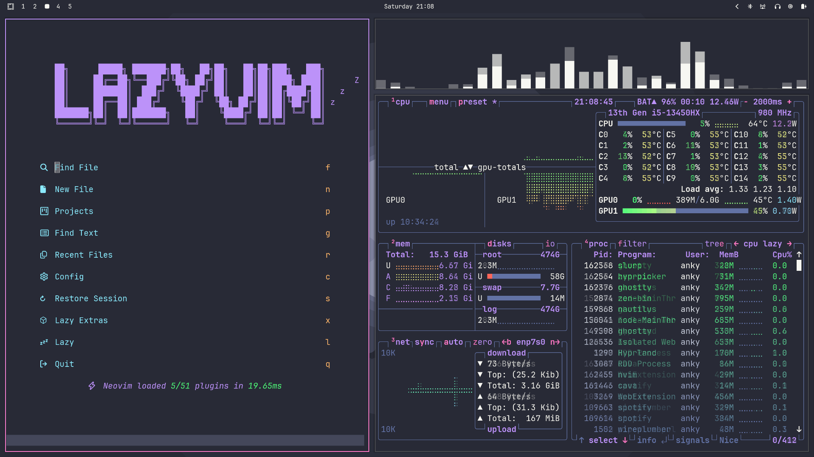

# Dracula Theme for Omarchy

Personal Dracula-inspired color palette for Omarchy.

A dark, high-contrast theme featuring vibrant accent colors on a deep purple-grey background.

## Aesthetic
- Dark, modern background (#282a36)
- Crisp, readable foreground (#f8f8f2)
- Vibrant accents (Purple, Pink, Cyan, Green, Yellow, Orange, Red)
- Professional and easy on the eyes for coding

## Included Theme Files
- `hyprland.conf` - Hyprland window manager config
- `ghostty.conf` - Ghostty terminal
- `alacritty.toml` - Alacritty terminal
- `kitty.conf` - Kitty terminal
- `waybar.css` - Waybar module
- `mako.ini` - Mako notification daemon
- `hyprlock.conf` - Hyprlock screen lock
- `wofi.css` - Wofi app launcher
- `walker.css` - Walker app launcher
- `swayosd.css` - SwayOSD
- `btop.theme` - Btop++ theme
- `warp.yaml` - Warp terminal
- `Dracula.theme.css` - Vesktop theme
- `colors.toml` - Generic colors config
- `chromium.theme` - Chromium browser theme
- `neovim.lua` - Neovim theme config
- `aether.override.css` - Aether overrides

## Screenshots

